# Gohezoh data model review

This ERD describes the database structure introduced by the migrations, including the Phase 6 Business Development and Phase 7 Warehouse/Fulfillment modules.

The PDF's first production flow is **Customer → Service Request → Order → Job → Partner → Delivery → POD → Customer Notification**. Phase 7 adds a controlled inventory-to-fulfillment handoff into that delivery flow.

## Current database ERD

Supabase owns `auth.users`; `profiles` and the role/membership tables extend that identity model.

```mermaid
erDiagram
    AUTH_USERS ||--o| PROFILES : profile
    AUTH_USERS ||--o{ USER_ROLES : has
    AUTH_USERS ||--o{ CUSTOMER_USERS : belongs
    CUSTOMERS ||--o{ CUSTOMER_USERS : members
    AUTH_USERS ||--o{ PARTNER_USERS : belongs
    LOGISTICS_PARTNERS ||--o{ PARTNER_USERS : members

    CUSTOMERS ||--o{ SERVICE_REQUESTS : submits
    CUSTOMERS ||--o{ INVENTORY_ITEMS : owns_stock
    WAREHOUSES ||--o{ WAREHOUSE_INVENTORY : stores
    INVENTORY_ITEMS ||--o{ WAREHOUSE_INVENTORY : stock_position
    WAREHOUSES ||--o{ INVENTORY_MOVEMENTS : movement_location
    INVENTORY_ITEMS ||--o{ INVENTORY_MOVEMENTS : movement_history
    CUSTOMERS ||--o{ FULFILLMENT_ORDERS : places
    WAREHOUSES ||--o{ FULFILLMENT_ORDERS : fulfills
    FULFILLMENT_ORDERS ||--|{ FULFILLMENT_ORDER_ITEMS : contains
    INVENTORY_ITEMS ||--o{ FULFILLMENT_ORDER_ITEMS : requested_item
    FULFILLMENT_ORDERS o|--o| SERVICE_REQUESTS : releases_to_delivery_review
    AUTH_USERS o|--o{ CUSTOMERS : assigned_bdo
    AUTH_USERS ||--o{ LEADS_OPPORTUNITIES : owns_pipeline
    AUTH_USERS ||--o{ PARTNER_PROSPECTS : develops
    LEADS_OPPORTUNITIES o|--o| CUSTOMERS : converts_to
    PARTNER_PROSPECTS o|--o| LOGISTICS_PARTNERS : approved_as
    LEADS_OPPORTUNITIES ||--o{ BUSINESS_DEVELOPMENT_ACTIVITIES : lead_history
    CUSTOMERS ||--o{ BUSINESS_DEVELOPMENT_ACTIVITIES : relationship_history
    PARTNER_PROSPECTS ||--o{ BUSINESS_DEVELOPMENT_ACTIVITIES : partner_history
    AUTH_USERS ||--o{ BUSINESS_DEVELOPMENT_ACTIVITIES : records
    AUTH_USERS ||--o{ BUSINESS_DEVELOPMENT_REPORTS : submits
    SERVICES ||--o{ SERVICE_REQUESTS : requested
    AUTH_USERS ||--o{ SERVICE_REQUESTS : creates
    AUTH_USERS o|--o{ SERVICE_REQUESTS : reviews

    SERVICE_REQUESTS ||--o| ORDERS : converts_to
    CUSTOMERS ||--o{ ORDERS : places
    SERVICES ||--o{ ORDERS : covers
    AUTH_USERS o|--o{ ORDERS : confirms

    ORDERS ||--o| JOBS : generates
    CUSTOMERS ||--o{ JOBS : owns
    SERVICES ||--o{ JOBS : uses
    LOGISTICS_PARTNERS o|--o{ JOBS : current_partner
    ROUTES o|--o{ JOBS : uses
    LOGISTICS_PARTNERS o|--o{ ROUTES : serves
    AUTH_USERS o|--o{ JOBS : operations_owner

    JOBS ||--o{ JOB_PARCELS : contains
    JOBS ||--o{ PARTNER_ASSIGNMENTS : assignment_history
    LOGISTICS_PARTNERS ||--o{ PARTNER_ASSIGNMENTS : assigned
    AUTH_USERS o|--o{ PARTNER_ASSIGNMENTS : assigns
    JOBS ||--o{ JOB_STATUS_HISTORY : status_changes
    AUTH_USERS o|--o{ JOB_STATUS_HISTORY : changes
    JOBS ||--o{ OTP_VERIFICATIONS : delivery_codes
    JOBS ||--o{ PROOF_OF_DELIVERY : delivery_proofs
    AUTH_USERS o|--o{ PROOF_OF_DELIVERY : records
    JOBS ||--o{ NOTIFICATIONS : relates_to
    AUTH_USERS ||--o{ NOTIFICATIONS : receives
    JOBS ||--o| JOB_FINANCIALS : financial_summary
    AUTH_USERS o|--o{ JOB_FINANCIALS : updates
    JOBS ||--o{ CUSTOMER_PAYMENTS : receipts
    AUTH_USERS ||--o{ CUSTOMER_PAYMENTS : records
    JOBS ||--o{ PARTNER_SETTLEMENTS : settlements
    LOGISTICS_PARTNERS ||--o{ PARTNER_SETTLEMENTS : paid_to
    AUTH_USERS ||--o{ PARTNER_SETTLEMENTS : approves
    AUTH_USERS o|--o{ AUDIT_LOGS : acts

    AUTH_USERS {
        uuid id PK
    }
    PROFILES {
        uuid user_id PK,FK
        text full_name
        text email
        text phone
    }
    USER_ROLES {
        uuid user_id PK,FK
        app_role role PK
    }
    CUSTOMERS {
        uuid id PK
        text customer_number UK
        text company_name
        customer_state status
        uuid created_by FK
    }
    WAREHOUSES {
        uuid id PK
        text warehouse_number UK
        text code UK
        text address
        text city
    }
    INVENTORY_ITEMS {
        uuid id PK
        uuid customer_id FK
        text sku
        text name
        numeric unit_value
        numeric weight_kg
    }
    WAREHOUSE_INVENTORY {
        uuid warehouse_id PK,FK
        uuid inventory_item_id PK,FK
        integer quantity_on_hand
        integer quantity_reserved
        text location_code
    }
    INVENTORY_MOVEMENTS {
        uuid id PK
        uuid inventory_item_id FK
        uuid warehouse_id FK
        text movement_type
        integer quantity_delta
    }
    FULFILLMENT_ORDERS {
        uuid id PK
        text fulfillment_number UK
        uuid customer_id FK
        uuid service_request_id FK
        text status
    }
    FULFILLMENT_ORDER_ITEMS {
        uuid fulfillment_order_id PK,FK
        uuid inventory_item_id PK,FK
        integer quantity
        integer picked_quantity
    }
    CUSTOMER_USERS {
        uuid customer_id PK,FK
        uuid user_id PK,FK
    }
    SERVICES {
        uuid id PK
        text code UK
        text name UK
        boolean is_active
    }
    LOGISTICS_PARTNERS {
        uuid id PK
        text partner_number UK
        text partner_name
        partner_state status
    }
    PARTNER_USERS {
        uuid partner_id PK,FK
        uuid user_id PK,FK
    }
    ROUTES {
        uuid id PK
        text route_number UK
        text origin_city
        text destination_city
        uuid partner_id FK
    }
    SERVICE_REQUESTS {
        uuid id PK
        text request_number UK
        uuid customer_id FK
        uuid service_id FK
        request_state status
        text parcel_summary
        jsonb parcel_items
    }
    ORDERS {
        uuid id PK
        text order_number UK
        uuid service_request_id UK,FK
        uuid customer_id FK
        uuid service_id FK
        order_state status
    }
    LEADS_OPPORTUNITIES {
        uuid id PK
        text lead_number UK
        text business_name
        business_lead_stage stage
        uuid assigned_bdo_id FK
        numeric opportunity_value
        date follow_up_at
        uuid converted_customer_id FK,UK
    }
    PARTNER_PROSPECTS {
        uuid id PK
        text prospect_number UK
        text partner_name
        business_partner_prospect_stage status
        uuid assigned_bdo_id FK
        text[] coverage_areas
        uuid converted_partner_id FK,UK
    }
    BUSINESS_DEVELOPMENT_ACTIVITIES {
        uuid id PK
        text activity_number UK
        uuid lead_id FK
        uuid customer_id FK
        uuid partner_prospect_id FK
        text activity_type
        uuid created_by FK
    }
    BUSINESS_DEVELOPMENT_REPORTS {
        uuid id PK
        text report_number UK
        uuid bdo_id FK
        date period_start
        date period_end
    }
    JOBS {
        uuid id PK
        text job_number UK
        uuid order_id UK,FK
        uuid customer_id FK
        uuid service_id FK
        uuid partner_id FK
        uuid route_id FK
        job_state status
    }
    JOB_PARCELS {
        uuid id PK
        uuid job_id FK
        smallint parcel_number
        integer quantity
        numeric weight_kg
    }
    PARTNER_ASSIGNMENTS {
        uuid id PK
        uuid job_id FK
        uuid partner_id FK
        assignment_state status
    }
    JOB_STATUS_HISTORY {
        bigint id PK
        uuid job_id FK
        job_state new_status
        timestamptz changed_at
    }
    OTP_VERIFICATIONS {
        uuid id PK
        uuid job_id FK
        text recipient_phone
        text code_hash
        timestamptz expires_at
        timestamptz verified_at
    }
    PROOF_OF_DELIVERY {
        uuid id PK
        uuid job_id FK
        text storage_path
        uuid recorded_by FK
    }
    NOTIFICATIONS {
        uuid id PK
        uuid user_id FK
        uuid job_id FK
        text channel
        text status
    }
    JOB_FINANCIALS {
        uuid job_id PK,FK
        numeric customer_revenue
        numeric partner_cost
    }
    CUSTOMER_PAYMENTS {
        uuid id PK
        text payment_number UK
        uuid job_id FK
        numeric amount
        text method
        text reference
        uuid recorded_by FK
    }
    PARTNER_SETTLEMENTS {
        uuid id PK
        text settlement_number UK
        uuid job_id FK
        uuid partner_id FK
        numeric amount
        text status
        uuid created_by FK
    }
    AUDIT_LOGS {
        bigint id PK
        text entity_type
        uuid entity_id
        uuid actor_id FK
    }
```

`o|` means optional; `||--o|` means zero or one. `AUDIT_LOGS.entity_id` is intentionally a polymorphic UUID rather than a foreign key.

## Relationship and workflow review

**Good foundation:** The main customer → request → order → job chain exists. A request can have at most one order, and an order can have at most one job. Jobs have parcel rows, status history, OTP hash records, POD metadata, partner assignments, and notification records. Customer and partner memberships support multiple users, and row-level security separates customer, partner, operations, and finance access.

**Implemented first-release flow:** Customer requests move through Operations review and conversion to an order/job, partner assignment, delivery status updates, recipient OTP verification, private POD storage, and customer in-app notifications. Finance can record job costs, receipts, and partner settlements in the local Phase 5 implementation. The release migrations still need to be applied to the linked production database before these features are live. Auth password-reset OTP is separate from the delivery-recipient OTP represented by `otp_verifications`.

**Parcel traceability:** New customer requests capture a structured parcel description, quantity, and optional weight in `service_requests.parcel_items`. The job creation trigger copies every parcel item into `job_parcels`, preserving its position and measurements. Historical and warehouse-created requests with only `parcel_summary` receive a single descriptive parcel row when a job is created.

The request-to-order function copies matching customer and service identifiers in one transaction. Assignment RPCs update both `jobs.partner_id` and `partner_assignments`. Server-side guards enforce status transitions and require a verified delivery OTP before delivery. The private POD bucket and customer access policies are configured in the migrations.

**Phased items:** Phase 5 Finance has a local manual receipt and settlement ledger, job profitability, and a dashboard; it does not connect to a payment processor. Phase 6 adds assigned leads/opportunities, customer conversion, partner prospects with management approval, activity history, reports, and a BDO dashboard. Phase 7 adds warehouse stock receiving, customer-owned inventory, reserved fulfillment orders, picking, packing, and an Operations-reviewed delivery request handoff. Financial writes are role-checked database functions, with row-level security separating customer receipts from internal costs and partner settlements.

## Current app versus release target

The customer portal supports account registration, service requests, order/job references, delivery tracking, POD, in-app notifications, customer receipts/balances, and account-scoped fulfillment orders. Operations controls request conversion, partner assignment, and delivery progress. Warehouse staff receive and pick customer inventory; packed fulfillment is handed to Operations for pricing and delivery review before a delivery job is created. Finance tracks job margins and reconciled receipts/settlements. BDO users can access only assigned prospects/customers and their own development activities; they cannot approve operational partners or access settlements. External SMS/email notifications and automated payment collection are not configured.

## Source checked

- `supabase/migrations/20260926120000_gohezoh_first_release_schema.sql`
- `supabase/migrations/20260927200000_register_customer_profile.sql`
- `src/App.tsx`
- `Gohezoh_Software.pdf`, especially sections 11–15, 23–27, and 29–31
